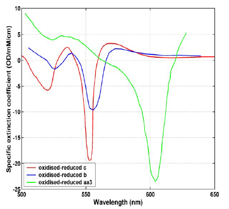

# UCL NIR Spectra
# Biomedical Optics Research Laboratory (BORL)

## Specific Extinction Spectra of Tissue Chromophores

**Important
note**:
- This repository is maintained by Prof. Tachtsidis, if you have any questions email i.tachtsidis@ucl.ac.uk
- We make an important
distinction between specific extinction coefficient and specific
absorption
coefficient. While both represent the level
of absorption per micromole (or millimole) of compound
per mm (or cm),
extinction is described using base 10 logarithm
units and absorption is described using natural logarithm
units. The
difference between them is a scaling factor
of ln10:specific absorption coefficient = specific
extinction coefficient x
2.3025851 .

### 1. Water Spectrum
A file containing the extinction coefficient of water at 37 degrees over the wavelength range 600 nm - 1050 nm may be
downloaded by clicking on the link below:

- [Extinction spectrum of pure water (600 nm -1050 nm)](spectra/matcher94_nir_water_37.txt)

The spectrum is sampled at 1 nm intervals, and contains a list of ascii pairs, with the format: wavelength (nm), extinction
coefficient (OD per cm). The measurement of this spectrum is described by Matcher et al [2].

The following extinction spectra were measured at 37 degrees and the temperature coefficients at each wavelength were
measured in the range 28 - 42 degrees. These measurements are described in the Ph.D. thesis of Dr. Veronica Hollis.

- [Extinction spectrum of pure water (650 nm - 924 nm)](spectra/water740_840_vhollis_2001_37.txt)
- [Temperature coefficient of water (OD per cm per degree C; 650 nm - 924 nm)](spectra/water740_840_vhollis_2001_coeff.txt)
- [Extinction spectrum of pure water (900 nm - 1050 nm)](spectra/water970_vhollis_2001_37.txt)
- [Temperature coefficient of water (OD per cm per degree C; 900 nm - 1050 nm](spectra/water970_vhollis_2001_coeff.txt)

### 2. Haemoglobin spectra
#### 2.1 UCL Spectra
Files containing the specific absorption spectra of haemoglobin (Hb) and oxyhaemoglobin (HbO2) over the near-infrared
wavelength range 650 nm - 1042 nm may be downloaded by clicking on the links below:

- [Specific absorption spectrum of haemoglobin (650 nm - 1042 nm)](spectra/hb02.txt)
- [Specific absorption spectrum of oxyhaemoglobin (650 nm - 1042 nm)](spectra/hb.txt)

The spectra are sampled at 1 nm intervals. Each file contains a list of ascii pairs, with the format: wavelength (nm), specific
absorption coefficient (per mm per micromolar). More details about the measurement of these spectra can be found in the
Ph.D. thesis of Dr. Mark Cope and the publications of Matcher et al [1,2].

#### 2.2 Spectra published by Zijlstra et al.
The specific extinction coefficients of various derivatives of both adult and fetal haemoglobin have been published by
Zijlstra et al [4]. We have converted the published data from values per haem group to values per functional group
(tetrahaem) by multiplying by a factor of four. Each of the following files contains spectra sampled at 2 nm intervals,
consisting of ascii pairs with the format: wavelength (nm), specific extinction coefficient (per cm per millimole):

- [Specific extinction coefficient of adult haemoglobin (450 nm - 630 nm)](spectra/z_adult_hb_450_630.txt)
- [Specific extinction coefficient of adult haemoglobin (600 nm - 800 nm)](spectra/z_adult_hb_600_800.txt)
- [Specific extinction coefficient of adult oxyhaemoglobin (450 nm - 630 nm)](spectra/z_adult_hbo2_450_630.txt)
- [Specific extinction coefficient of adult oxyhaemoglobin (600 nm - 800 nm)](spectra/z_adult_hbo2_600_800.txt)
- [Specific extinction coefficient of adult carboxyhaemoglobin (450 nm - 630 nm)](spectra/z_adult_hbco_450_630.txt)
- [Specific extinction coefficient of adult carboxyhaemoglobin (600 nm - 800 nm)](spectra/z_adult_hbco_600_800.txt)
- [Specific extinction coefficient of adult haemiglobin (450 nm - 630 nm)](spectra/z_adult_hi_450_630.)
- [Specific extinction coefficient of adult haemiglobin (600 nm - 800 nm)](spectra/z_adult_hi_600_800.txt)
- [Specific extinction coefficient of adult haemiglobin (700 nm-1000 nm)](spectra/z_adult_hi_700_1000.txt)
- [Specific extinction coefficient of adult haemiglobincyanide (450 nm - 630 nm)](spectra/z_adult_hicn_450_630.txt)
- [Specific extinction coefficient of adult haemiglobincyanide (600 nm - 800 nm)](spectra/z_adult_hicn_600_800.txt)
- [Specific extinction coefficient of adult sulfhaemiglobin (450 nm - 630 nm)](spectra/z_adult_shb_450_630.txt)
- [Specific extinction coefficient of adult sulfhaemiglobin (600 nm - 800 nm)](spectra/z_adult_shb_600_800.txt)
- [Specific extinction coefficient of fetal haemoglobin (450 nm - 630 nm)](spectra/z_fetal_hb_450_630.txt)
- [Specific extinction coefficient of fetal haemoglobin (600 nm - 800 nm)](spectra/z_fetal_hb_600_800.txt)
- [Specific extinction coefficient of fetal oxyhaemoglobin (450 nm - 630 nm)](spectra/z_fetal_hbo2_450_630.txt)
- [Specific extinction coefficient of fetal oxyhaemoglobin (600 nm - 800 nm)](spectra/z_fetal_hbo2_600_800.txt)
- [Specific extinction coefficient of fetal carboxyhaemoglobin (450 nm - 630 nm)](spectra/z_fetal_hbco_450_630.txt)
- [Specific extinction coefficient of fetal carboxyhaemoglobin (600 nm - 800 nm)](spectra/z_fetal_hbco_600_800.txt)
- [Specific extinction coefficient of fetal haemiglobin (450 nm - 630 nm)](spectra/z_fetal_hi_450_630.txt)
- [Specific extinction coefficient of fetal haemiglobin (600 nm - 800 nm)](spectra/z_fetal_hi_600_800.txt)

a Generated by
polynomial fit to data published in table 8.4 of Zijlstra et al. [4].

### 3. Cytochrome Spectra
The difference extinction spectrum (units of OD per cm per millimole) of cytochrome oxidase (Cyt) over the wavelength
range 650 nm - 986 nm may be downloaded by clicking on following:

- [Difference extinction spectrum of cytochrome oxidase (650 nm - 986 nm)](spectra/cytoxidase_diff_odmMcm.txt)

Note that since the total cytochrome oxidase concentration does not change, in vivo near-infrared measurements need only
be made of the change in redox state, and therefore it is only necessary to know the difference spectrum between the
oxidised and reduced forms of the enzyme. The difference spectrum provided here contains a small contribution from
cytochromes other than cytochrome oxidase found in tissue. The contribution of cytochrome to overall absorption in tissue
is considerably less than that of haemoglobin because of its lower concentration. Typically, the neonatal brain will have 40-
60 micromoles of haemoglobin and 2-3 micromoles of cytochrome oxidase. For useful physiological measurements, one
should expect to resolve changes of 1 micromole in haemoglobin and 0.1 micromoles of cytochrome oxidase.

Cytochrome spectra measured at visible wavelengths are also available for download by clicking on the links below. These
were all measured from bovine heart mitochondria and are described by Heinrich [3]. Note that in the visible region
absorption by the cytochrome oxidase complex is due to the haem a and a3 components, and not the Copper A as for the
near-infrared spectra.

- [Specific extinction spectrum of oxidised cytochrome c (500 nm - 650 nm)](spectra/liao96_vis_cytaa3_diff.txt)
- [Specific extinction spectrum of reduced cytochrome c (500 nm - 650 nm)](spectra/lubber_vis_cytc_red.txt)
- [Specific extinction spectrum of oxidised cytochrome b (505 nm - 640 nm)](spectra/lubber_vis_cytb_ox.txt)
- [Specific extinction spectrum of reduced cytochrome b (505 nm - 640 nm)](spectra/lubber_vis_cytb_red.txt)
- [Specific extinction spectrum of oxidised cytochrome oxidase (500 nm - 630 nm)](spectra/lubber_vis_cytcox_ox.txt)
- [Specific extinction spectrum of reduced cytochrome oxidase (500 nm - 630 nm)](spectra/lubber_vis_cytcox_red.txt)

The difference spectra for the above set of data are shown in the graph below.

Various other visible cytochrome spectra are available by clicking on the links below:

- [Difference extinction spectrum of cytochrome c (380 nm - 710 nm) c ](spectra/springett-cooper95_vis_cytc_diff.txt)
- [Difference extinction spectrum of cytochrome b (541 nm - 576 nm) d ](spectra/rich_vis_cytb_diff_1nmshifted.txt)
- [Difference extinction spectrum of cytochrome c oxidase (350 nm - 700 nm) e ](spectra/lubber_vis_cytc_ox.txt)
- [Specific extinction spectrum of oxidised cytochrome c (500 nm - 1000 nm) f ](spectra/cooper%20pig%20c%20oxidised.txt)
- [Specific extinction spectrum of reduced cytochrome c (500 nm - 1000 nm) f ](spectra/cooper%20pig%20c%20reduced.txt)
- [Specific extinction spectrum of oxidised cytochrome b (402 nm - 997 nm) g ](spectra/cope%20cyt%20b%20oxidised.txt)
- [Specific extinction spectrum of reduced cytochrome b (402 nm - 997 nm) g ](spectra/cope%20cyt%20b%20reduced.txt)
- [Specific extinction spectrum of oxidised cytochrome c oxidase (520 nm - 999 nm) h ](spectra/moody%20cyt%20aa3%20oxidised.txt)
- [Specific extinction spectrum of reduced cytochrome c oxidase (520 nm - 999 nm) h ](spectra/moody%20cyt%20aa3%20reduced.txt)

c This was measured on bovine mitochondria by Springett and Cooper at UCL in 1995.

d This was measured by Prof. Peter Rich at UCL on bacterial cytochrome b and has been red-shifted by 1 nm to be
equivalent to mammalian cytochrome.

e This difference spectrum was measured by Liao and Palmer [5].

f Measured by Prof. Chris Cooper at Essex University on porcine heart.

g Described in the Ph.D. thesis of Dr. Mark Cope. Note there is a discontinuity at 640 nm due to a filter change, although
this does not appear in the difference spectrum (i.e. oxidised - reduced).

h These data are from bovine heart, measured by Dr. John Moody at the University of Plymouth.

### References

1. Matcher, SJ, Elwell, CE, Cooper, CE, Cope, M, and Delpy, DT (1995): Performance comparison of several
published tissue near-infrared spectroscopy algorithms. Analytical Biochemistry 227(1), 54-68.
2. Matcher, SJ, Cope, M, and Delpy, DT (1994): Use of the water absorption spectrum to quantify tissue
chromophore concentration changes in near infrared spectroscopy.
Physics in Medicine & Biology 39,
177-196.
3. Heinrich, U (1981): Untersuchungen zur qualitativen photometrischen analyse der redox-zustande der
atmungskette in vitro und in vivo am beispiel des gehirns. PhD thesis, Abteilung fur Biologie and der Ruhr-
Universitat Bochum. These data were kindly supplied by Professor D. W. Lubbers.
4. Zijlstra, WG, Buursma, A, and van Assendelft, OW (2000): Visible and near infrared absorption spectra of
human and animal haemoglobin (VSP: Utrecht). ISBN 90-6764-317-3
5. Laio, G-L, and Palmer, G (1996): The reduced minus oxidized difference spectra of cytochromes a and a3.
Biochimica et Biophysica Acta 1274, 109-111.
